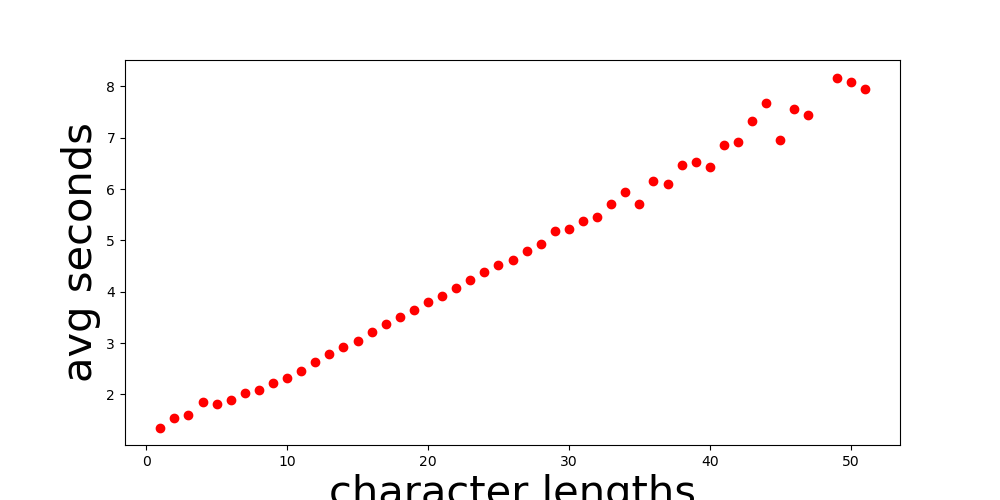
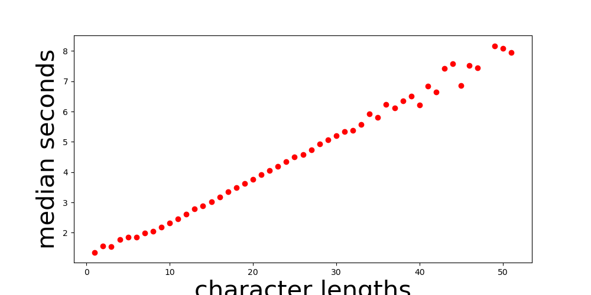
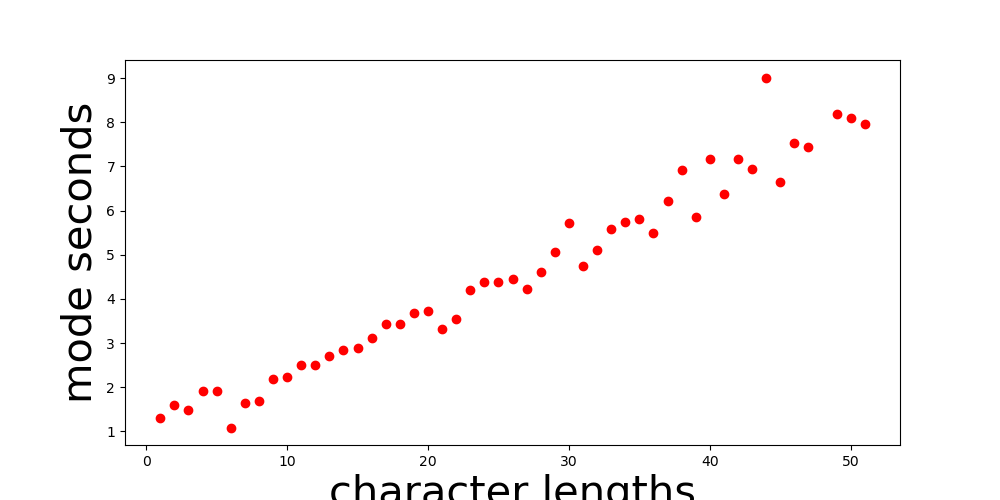
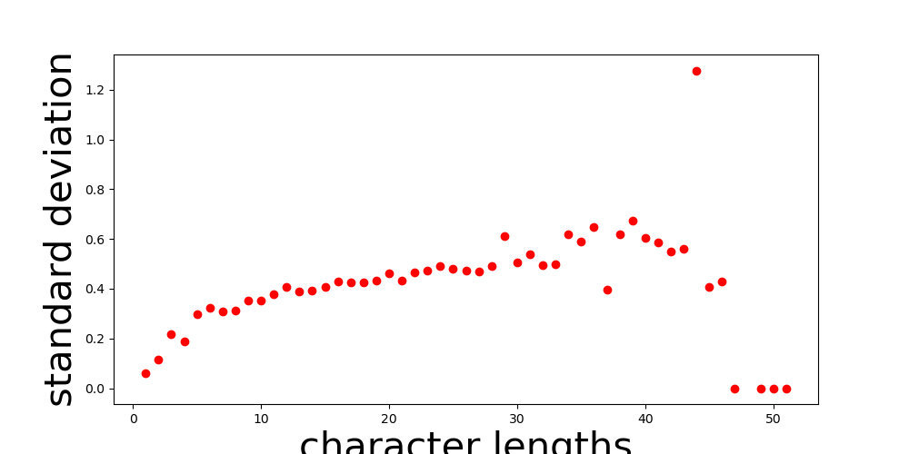
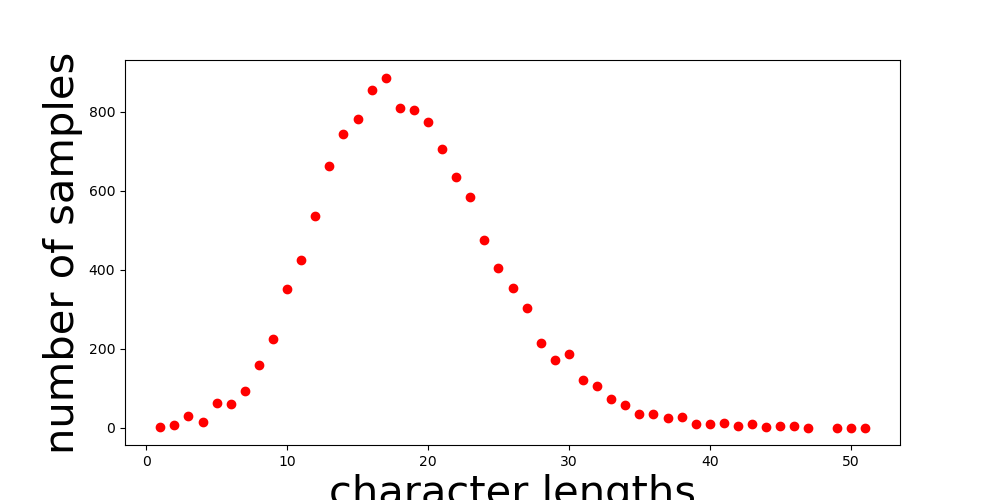
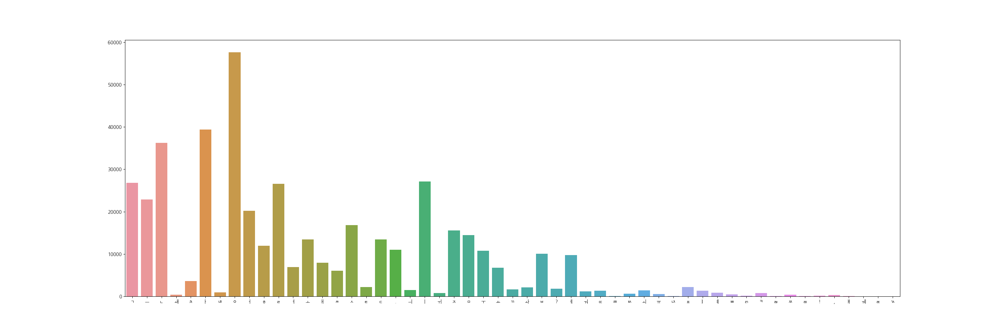

본 코드는 면접 사전 과제를 위해 작성되었음.
[MycroftAI/mimic2](https://github.com/MycroftAI/mimic2)를 기반으로 작성되었으며 대부분 원본 코드와 크게 다르지 않음.


## Dependency
원본의 requirements.txt를 사용하여 대부분 원본과 같은 버전의 라이브러리를 사용하였음.
   ```
   pip install -r requirements.txt
   ```
이외에 librosa 0.6.0, python3 3.7, tensorflow-gpu 1.8, cuda 10.1, cuDNN 7.6.5 버전으로 gpu환경에서 실행하였음.


## Data
[Korean Single Speaker Speech Dataset](https://www.kaggle.com/bryanpark/korean-single-speaker-speech-dataset) 해당 데이터를 사용하였음


## Preprocessing
  ```
   python3 preprocess.py --dataset KSS
   ```
위의 명령을 사용해 데이터 전처리 진행 


## Visualizing
총 6개의 시각화 데이터를 만들었으며 이는 아래와 같음

```
    python analyze.py --train_file_path=~/tacotron/training/train.txt --save_to=~tacotron/visuals --cmu_dict_path=~/cmudict-0.7b
```

### Average Seconds vs Character Lengths


### Median Seconds vs Character Lengths


### Mode Seconds vs Character Lengths


### Standard Deviation vs Character Lengths


### Number of Samples vs Character Lengths


### Phoneme Distribution
[JDongian/python-jamo](https://github.com/JDongian/python-jamo) 사용하여 초, 중, 종성을 추출하여 등장 빈도수를 그래프화 하였음.


